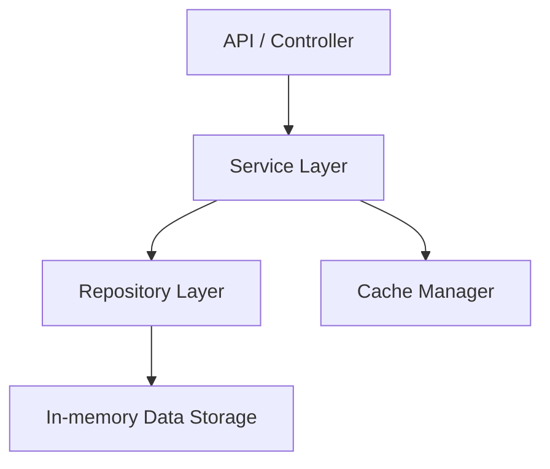

# PR-review-MCP-demo

A small, realistic Python backend service repository used to test an AI-powered GitHub Pull Request review MCP.

## Purpose

This repository provides a clean baseline backend with clear layering (controller → service → repository) and in-memory data storage.  
It is intentionally compact so reviewers can understand it quickly while still surfacing meaningful backend interactions.

## Architecture overview



## Repository structure

```text
src/
  __init__.py
  api/
    __init__.py
    payment_controller.py
  services/
    __init__.py
    payment_service.py
    user_service.py
  repositories/
    __init__.py
    payment_repository.py
    user_repository.py
  models/
    __init__.py
    payment.py
    user.py
  cache/
    __init__.py
    cache_manager.py

tests/
  __init__.py
  test_payment_service.py
  test_user_service.py
```

## Install dependencies

```bash
python -m pip install -r requirements.txt
```

## Run tests

```bash
pytest
```

## Example payment flow

1. Create a payment via the controller/service.
2. Retrieve the payment by ID.
3. Update payment status (for example to `completed`).
4. If needed, call retry handling to move failed payments back to `pending` while under retry limit.